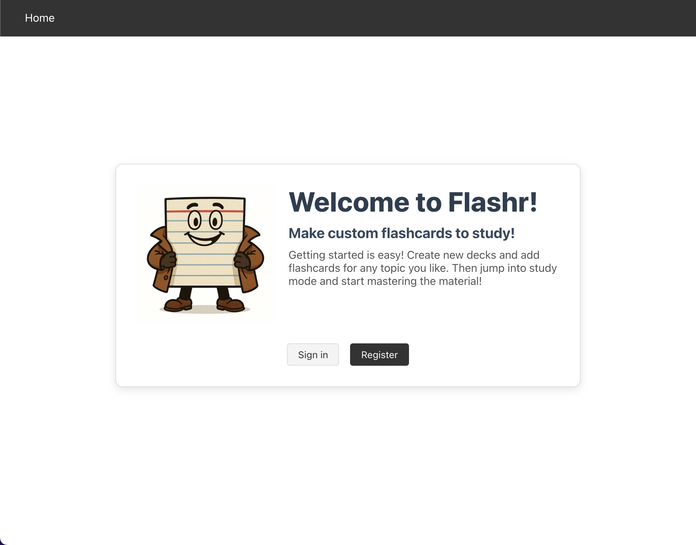
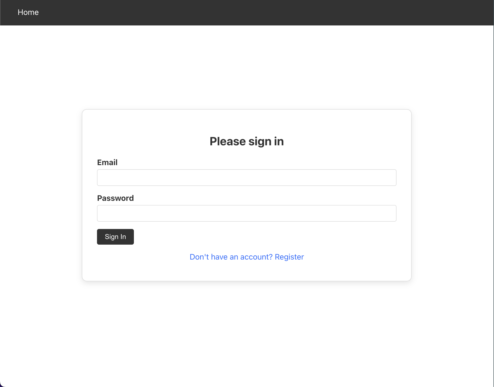
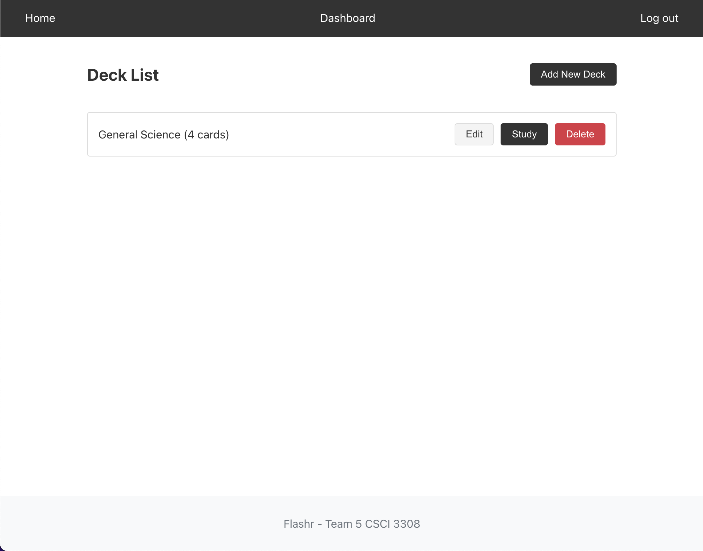
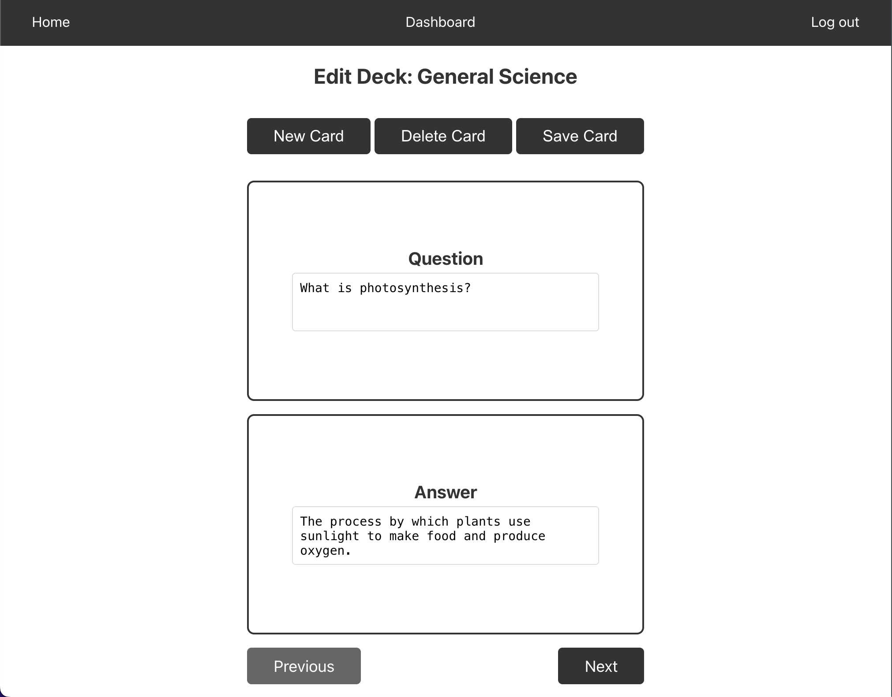
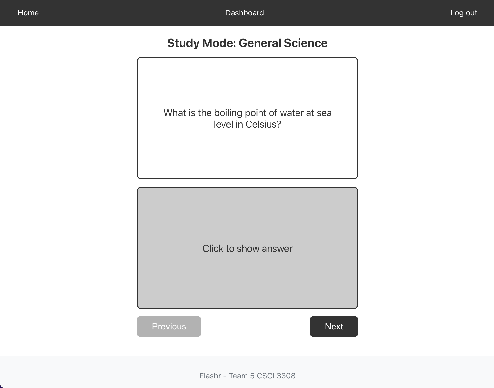
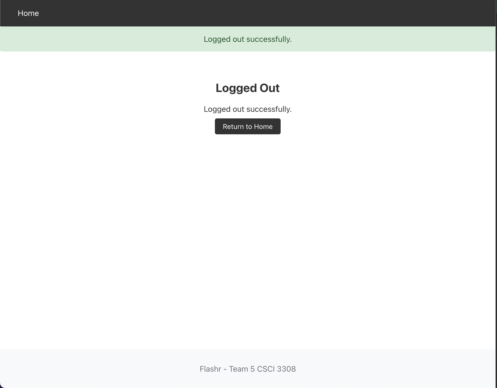
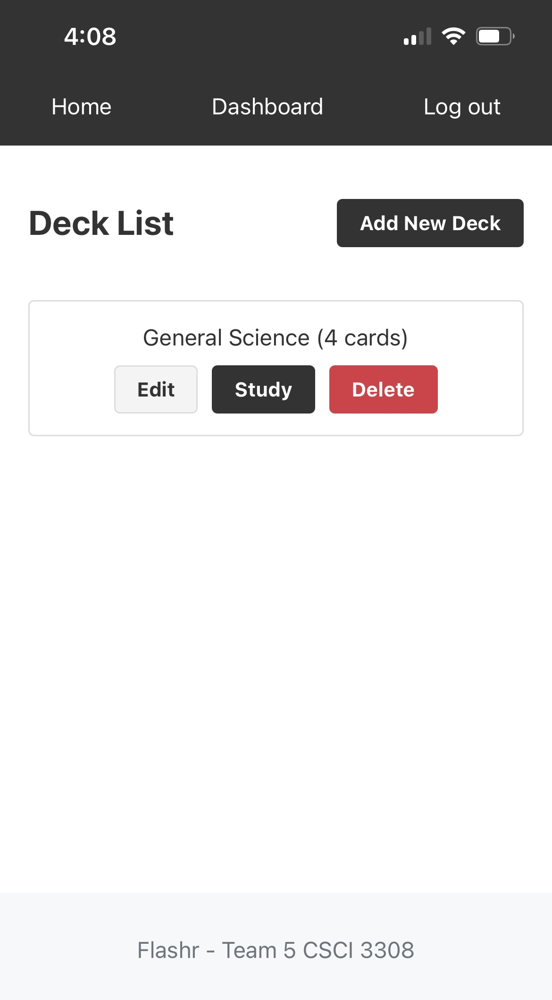
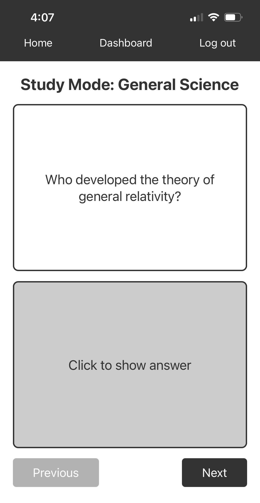

# Flash Card App

## Overview

For our CSCI 3308 final project, Team 5 built a flashcard web application to help students create and study decks of flashcards.

## Features
-   **User Authentication**: Secure registration and login for users.
-   **Dashboard**: A central place for users to manage their flashcard decks.
-   **Deck Management**: Create, Read, Update, and Delete decks.
-   **Card Management**: Create, Read, Update, and Delete cards within decks.
-   **Study Mode**: Study flashcards by reviewing them in a randomized order.

## Technology Stack
-   **Backend**: Node.js, Express.js
-   **Frontend**: Handlebars.js
-   **Database**: PostgreSQL
-   **Development**: Docker

## Installation

```sh
# Prerequisites: Install Docker (https://docker.com/)
# Clone repo
git clone https://github.com/travisformayor/csci3308_team_5.git
cd csci3308_team_5
# Start Docker container
docker compose up --build
```

You can then access the app at [http://localhost:3000](http://localhost:3000).

## Running Tests

```sh
# Running unit and integration tests
npm test
```

## Deployment

The application is deployed on Render at [https://csci3308-team-5.onrender.com/](https://csci3308-team-5.onrender.com/)

## Team Contributions

### Contributors
-   Chase Harrison
-   Michael Gaydos
-   Sean Lim
-   Travis Uhrig

### Task Management

Our team's task breakdown and delegation can be found on our [Trello project board](https://trello.com/b/KYdA7VJZ/team-5-flash-card-app).

## Screenshots

### Desktop View
| Home | Login | Dashboard |
| --- | --- | --- |
|  |  |  |
| **Edit Deck** | **Study Mode** | **Logout** |
|  |  |  |

### Mobile View (Responsive)
| Mobile Dashboard | Mobile Study Mode |
| --- | --- |
|  |  |
