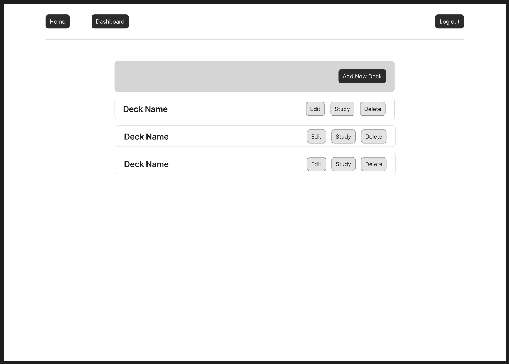

# Team Check-In for Sunday, July 20th

## Project Overview
Team 5 is building a flashcard web app for the CSCI 3308 final project

## Updates

- Auth, Deck, Card, Dashboard, and Study mode routes completed
- Auth frontend completed
- Unit tests for auth added
- Dashboard frontend started - deck listing completed
- Multiple PR's from various team members completed, approved, and merged (see Pull Requests tab)
- Tracked Progress on [team Trello board](https://trello.com/b/KYdA7VJZ/team-5-flash-card-app)

## Figma Mockups
<table style="width:100%">
  <tr>
    <td style="padding:10px; width: 50%;">
      
    </td>
    <td style="padding:10px; width: 50%;">
      
    </td>
  </tr>
  <tr>
    <td style="padding:10px; width: 50%;">
      
    </td>
    <td style="padding:10px; width: 50%;">
      
    </td>
  </tr>
  <tr>
    <td style="padding:10px; width: 50%;">
      
    </td>
    <td style="padding:10px; width: 50%;">
      
    </td>
  </tr>
  <tr>
    <td style="padding:10px; width: 50%;">
      
    </td>
    <td style="padding:10px; width: 50%;">
    </td>
  </tr>
</table>
