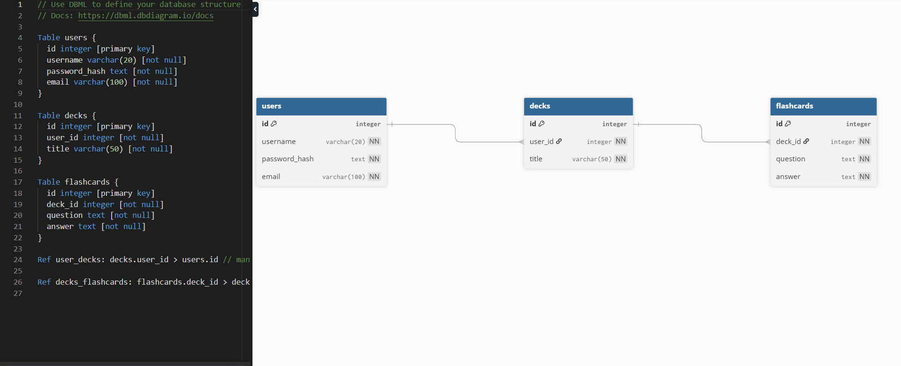
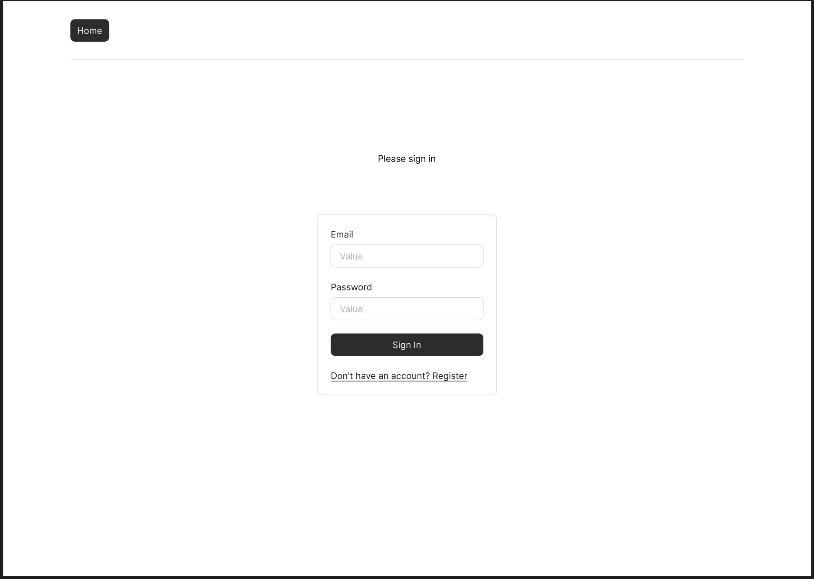

# Team Check-In for Sunday, July 6th

## Project Overview
Team 5 is building a flashcard web app for the CSCI 3308 final project

## Product Requirements Document
[View the PRD](planning/PRD.md)

## Entity-Relationship Diagram

## Figma Mockups
<table style="width:100%">
  <tr>
    <td style="padding:10px; width: 50%;">
      
    </td>
    <td style="padding:10px; width: 50%;">
      
    </td>
  </tr>
  <tr>
    <td style="padding:10px; width: 50%;">
      
    </td>
    <td style="padding:10px; width: 50%;">
      
    </td>
  </tr>
  <tr>
    <td style="padding:10px; width: 50%;">
      
    </td>
    <td style="padding:10px; width: 50%;">
      
    </td>
  </tr>
</table>
