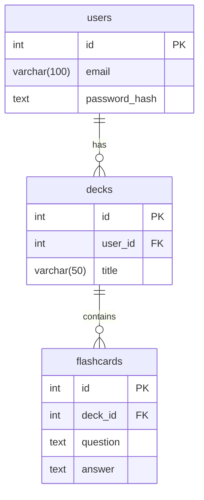

# Flash Card App: Product Requirements Document

**Authors:** Team 5

## 1. Introduction

*   **Goal**: Build a flashcard web app that meets the CSCI 3308 project requirements.
*   **Target Audience**: Students.

## 2. MVP Features
This section outlines the planned features that will be turned in.

### 2.1 User Authentication
*   Registration page for new accounts.
*   Login page for existing users.
*   Hash passwords before database storage.
*   Maintain user sessions after login.
*   Provide an option for users to sign out (end their session).

### 2.2 Core Application Functionality
*   Post-login Dashboard/home page.
*   CRUD (Create, Read, Update, Delete) operations for Decks and Cards.
*   Each Card belongs to one Deck.
*   Study Mode with random Card shuffling for a selected Deck.
*   In Study Mode, user moves through each Card until they exit.

## 3. Glossary

| Term | Definition |
| :--- | :--- |
| **Deck** | A user-created collection of flashcards. |
| **Card** | A flashcard with a question on top and answer on bottom. Belongs to one Deck. |
| **Session** | Authenticated user state, maintained via cookie. |
| **Study Mode**| Interface for Card review with shuffled cards. |

## 4. Database Overview

### Entity-Relationship Diagram (ERD)

## 5. Application Routes

Server routes follow the server-side rendering (SSR) pattern.

| Method | Route | Auth Required? | Action | Request Data (from `req`) | Render/Response Data (to `res`) | Notes |
| :--- | :--- | :--- | :--- | :--- | :--- | :--- |
| `GET` | `/` | No | Renders home page or redirects if logged in. | `session` | Redirects to `/dashboard` if logged in. Otherwise, renders `pages/home`. | Checks `req.session.user` to decide whether to render or redirect. |
| `GET` | `/register` | No | Renders the registration page. | `N/A` | Renders `pages/register`. | Renders a static page. |
| `POST` | `/register` | No | Processes new user registration. | `body: { email, password }` | On success, redirects to `/login`. On failure, renders `pages/register` with `{ error, message }`. | Hashes the password with bcrypt, then creates a new user record in the DB. |
| `GET` | `/login` | No | Renders the login page. | `N/A` | Renders `pages/login`. | Renders a static page. |
| `POST` | `/login` | No | Processes user login, starts session. | `body: { email, password }` | On success, redirects to `/dashboard`. On failure, renders `pages/login` with `{ error, message }`. | Finds user by email, compares hashed password, then sets `req.session.user`. |
| `GET` | `/logout` | Yes | Clears user session and logs out. | `session` | Renders `pages/logout` with a confirmation message. | Destroys the current session to log the user out. |
| `GET` | `/dashboard` | Yes | Renders dashboard with user's decks. | `session` | Renders `pages/dashboard` with `{ decks: [{ id, title, cardCount }] }`. | Queries DB for all decks belonging to the `req.session.user.id`. |
| `POST` | `/decks/create` | Yes | Creates a new deck. | `session`, `body: { title }` | On success, redirects to `/decks/edit/:deck_id/card/:card_id`, where card_id is the newly created blank card. | Creates a new deck record and inserts an initial blank card associated with it. DB insert returns both the new deck id and card id for the redirect. |
| `POST` | `/decks/delete/:deck_id` | Yes | Deletes a deck. | `session`, `params: { deck_id }` | On success, redirects to `/dashboard`. On failure, renders `pages/dashboard` with `{ error, message, decks }`. | Deletes the deck record and all of its associated card records (cascade). |
| `GET` | `/decks/edit/:deck_id` | Yes | Redirects to the editor for the newest card in a deck. | `session`, `params: { deck_id }` | Redirects to `/decks/edit/:deck_id/card/:card_id`. | Finds the newest card in the deck (e.g., `ORDER BY id DESC LIMIT 1`) to determine the redirect URL. |
| `GET` | `/decks/edit/:deck_id/card/:card_id` | Yes | Renders the editor for a specific card. | `session`, `params: { deck_id, card_id }` | Renders `pages/edit-deck` with `{ deck, card, nextCardId, prevCardId }`. | Fetches the current card, and runs separate queries to find the next and previous card IDs for navigation. |
| `POST` | `/decks/:deck_id/cards/add` | Yes | Adds a new, blank card to a deck. | `session`, `params: { deck_id }` | On success, redirects to the new card's editor URL (`/decks/edit/.../:card_id`). On failure, redirects to the main deck editor (`/decks/edit/:deck_id`) with an error. | Inserts a new, empty card record into the DB, returning the new `card_id` for the redirect. |
| `POST` | `/cards/save/:card_id` | Yes | Updates a card's content. | `session`, `params: { card_id }`, `body: { question, answer }` | On success, redirects to the same editor URL (`/decks/edit/.../:card_id`). On failure, re-renders `pages/edit-deck` with `{ error, card }`, were card is the body data sent back to preserve the user input. | Runs an `UPDATE` query on the `flashcards` table for the given `card_id`. |
| `POST` | `/cards/delete/:card_id` | Yes | Deletes a card. | `session`, `params: { card_id }` | On success, redirects to the main deck editor (`/decks/edit/:deck_id`). On failure, redirects to the card's editor URL with an error. | Runs a `DELETE` query on the `flashcards` table for the given `card_id`. |
| `GET` | `/decks/study/:deck_id` | Yes | Renders the study mode page. | `session`, `params: { deck_id }` | Renders `pages/study-mode` with `{ deck: { id, title }, cards: [...] }` (shuffled). | Fetches all cards, shuffles the array, then renders the page. |

## 6. Views

| Page Name | Route | Auth Required? | Description |
| :--- | :--- | :--- | :--- |
| **Login** | `/login` | No | Login form. |
| **Register** | `/register` | No | Registration form. |
| **Dashboard** | `/dashboard` | Yes | Lists decks and allows deck creation/deletion. |
| **Card Editor** | `/decks/edit/:deck_id/card/:card_id` | Yes | Edits one card at a time with navigation. |
| **Study Mode** | `/decks/study/:deck_id` | Yes | Shows cards for studying. Uses some JS to manage navigating the cards array and revealing answers |

### Partials

| Partial Name | File Path | Description | Used In |
| :--- | :--- | :--- | :--- |
| **Navbar** | `partials/navbar.hbs` | Navigation bar with links to Home, Dashboard, and Logout. | Dashboard, Card Editor, Study Mode |
| **Deck Item** | `partials/deck-item.hbs` | Reusable template for a single deck entry, including title, Study/Edit/Delete buttons. | Dashboard |
| **Error Message** | `partials/error.hbs` | Displays error messages. | Any page that handles form errors (e.g., Login, Register, Dashboard, Card Editor) |

## 7. User Flows

### User Registration and Login
The home page for unauthenticated users is a landing page with options to "Sign In" or "Register". Clicking these buttons takes the user to the respective pages. After a successful login, the user is redirected to their dashboard. All authenticated pages (Dashboard, Edit Deck, Study Mode) have a navigation bar with a link to the Home, Dashboard and a "Logout" button.

### Create a New Deck
On the dashboard, the logged-in user clicks the "Add New Deck" button. This action reveals an inline form with a text input for the deck's name, a "Save" button, and a "Cancel" button. Clicking "Save" creates the new deck and redirects the user to the Edit Deck page for the newly created deck, which starts with one blank card ready for input. Clicking "Cancel" reverts the view to just show the "Add New Deck" button.

### Delete a Deck
On the dashboard, when logged in, there is a "Delete" button next to each deck. Clicking it deletes the deck and all of its cards. (Stretch goal: confirmation dialog before deck deletes.)

### Editing a Deck
On the dashboard, the user clicks the "Edit" button next to each deck. This takes the user to the Edit Deck page. The page displays the deck's title at the top left. It also has "Add new Card", "Save Card", and "Delete Card" buttons. Below, the "Previous" and "Next" buttons allow the user to look at all cards belonging to the deck.

### Managing Cards in a Deck
On the Edit Deck page, users manage cards directly.
*   **Create a Card:** Clicking the "Add new Card" button adds a new, empty card form (with question and answer input fields, and a "Save" button) to the list of cards.
*   **Edit a Card:** Each card in the deck is displayed as a form with its question and answer in input fields. The user can modify the text and click a "Save Card" button to update the card.
*   **Delete a Card:** Each card has a "Delete Card" button. Clicking it removes the card from the deck.

### Study a Deck
On the dashboard, the user clicks the study deck button. A request for all of the cards in the deck is sent as an array and the response is shuffled. Opens the study deck page which shows a card with only the question field visible and the answer field hidden with JS/CSS. A ‘reveal’ button under the card makes the answer field visible. Next card and back card buttons move to other cards by swapping out the values of the question and answer fields and hiding the answer again.

### Logout
Clicking the Logout button in the nav bar ends the session and redirects the user to the login screen.

## 8. Security & Session Management

*   **Session Management**: Use `express-session` with a secure, random secret to sign the session ID cookie.
*   **Password Hashing**: Use `bcrypt` to hash passwords. Compare hashes on login.
*   **SQL Injection Prevention**: Use parameterized queries with `pg-promise`.

## 9. Development Process & DevOps

*   **Git Workflow**: Use a feature-branching workflow. Each user story or feature must be developed in a separate branch. Merge changes to `main` via pull requests, which must be reviewed by at least one other team member.
*   **Project Management**: Track progress using a GitHub Project board with at least four columns (e.g., Backlog, In Progress, In Review, Done). Use epics to organize major features.
*   **Local Development**: Use Docker and `docker-compose` with `web` (Node.js) and `db` (PostgreSQL) services. Initialize local DB schema with `.sql` scripts in `/docker-entrypoint-initdb.d`.
*   **Production Deployment**: Deploy to Render with a managed PostgreSQL database and a Node.js web service.
*   **Production Database Initialization**: Manually initialize production schema by running `.sql` scripts via `psql`.

## 10. Testing

*   **Frameworks**: Mocha, Chai, and `chai-http` for server-side tests.
*   **Execution**: Run tests from `/test` with `npm test`.
*   **Requirements**: Test at least one core data-retrieval endpoint (e.g., fetching user decks).
*   **Authentication Testing**: Use `chai-http` agent to test authenticated routes by persisting session cookies.
*   **User Acceptance Testing**:  Define and execute user acceptance test cases to verify user flows (e.g., sign up, login, creating/deleting Decks, adding/editing/deleting Cards, studying) work as intended from an end-user perspective. A minimum of 4 use cases must be tested.

## 11. Stretch Goals

Features beyond the MVP scope.

*   Easy/Hard card tracking: In Study Mode, allow users to mark Cards 'Easy' or 'Hard', with 'Easy' Cards removed from the current study round and 'Hard' Cards reshuffled until all marked 'Easy'.
*   Persistent study progress: Save in-memory study session to a `jsonb` column in the `Decks` table, allowing users to resume or reset a Deck's study progress.
*   Card tagging cards and then filtering a Deck by tags in Study Mode.
*   Rich text, image, and LaTeX support in Cards.
*   Sharing Decks or Cards with other users.
*   User profiles.

## 12. Documentation & Deliverables

*   **README.md**: Must contain an application description, list of contributors, technology stack, prerequisites, setup instructions, test instructions, and a link to the deployed application.
*   **Final Project Report**: A PDF document that includes:
    *   A complete Use Case Diagram.
    *   Mockups for every application page.
    *   A section detailing each team member's contributions.
    *   Results and observations from User Acceptance Testing.
*   **Video Demo**: A video (5 minutes or less) demonstrating the final project.

## 13. Success Metrics

*   **Functionality:** All MVP features are implemented and working.
*   **Deployment:** Application is deployed to Render and accessible.
*   **Documentation:** All deliverables (README, Project Report, Video) are complete and meet requirements.
*   **Completion:** Successful delivery of final presentation and project report.
